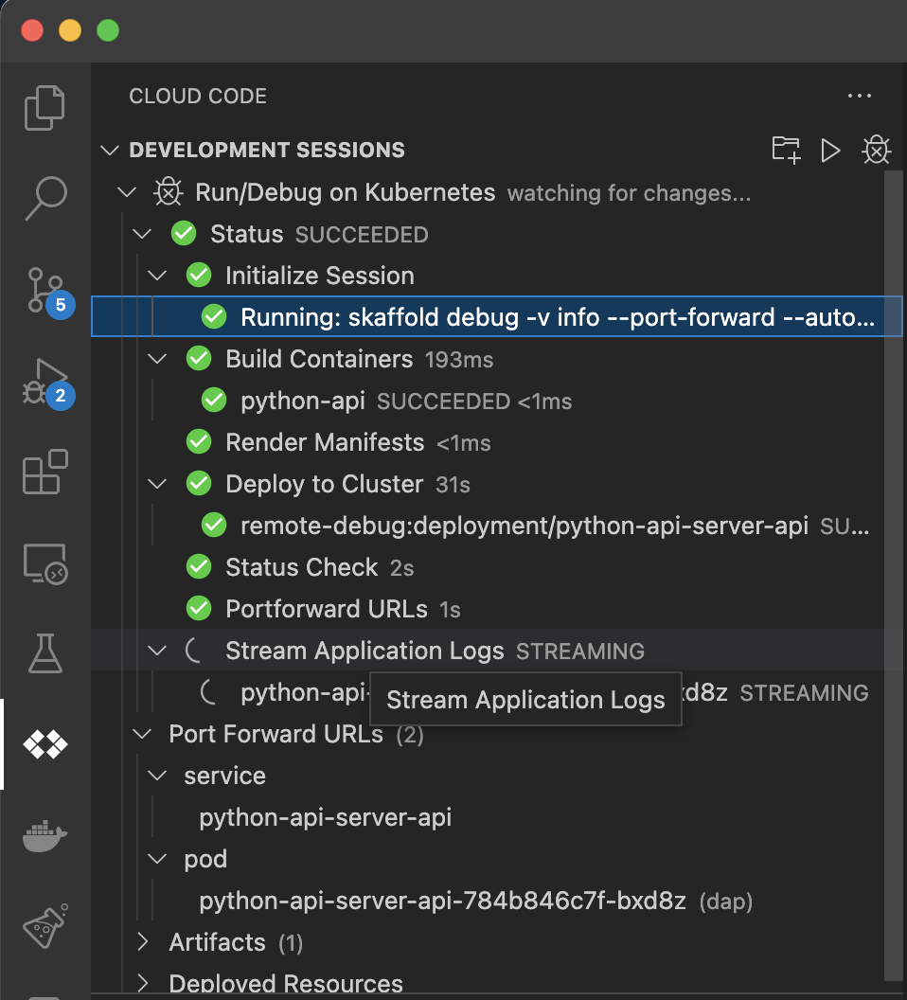
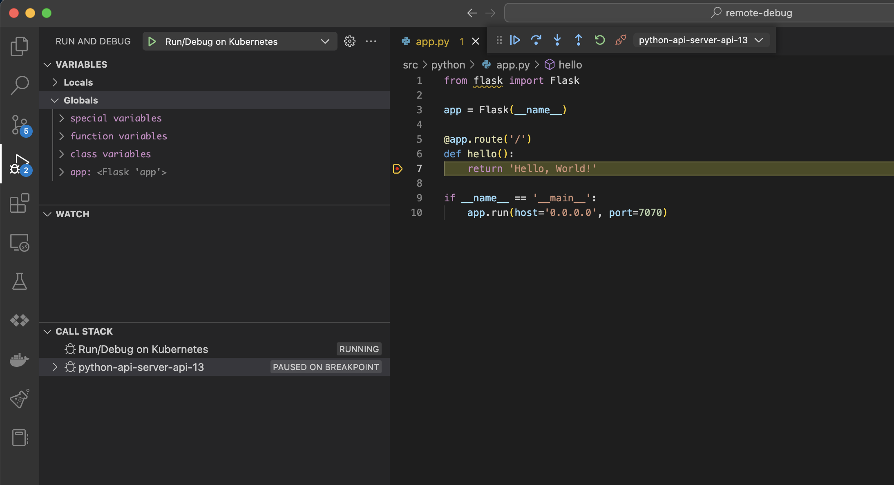

# remote-debug

An example demonstrates how to debug applications in the cloud 
by running applications for different programming languages

### Requirements

- minikube (or real kubernetes cluster)
- skaffold binary [insttall](https://skaffold.dev/docs/install/)
- telepresence binary

### Getting starting

**Run**

```bash
$> make help

# Run scaffold or use vscode launch.json
$> make minikube-up
$> make skaffold-up

# DNS resolve
$> make telepresence-up
$> curl http://golang-api.remote-debug:7070/test
```

**Down**

```bash
$> make down
```

### Debug




#### Tooling

- [minikube](https://minikube.sigs.k8s.io/docs/)
- **DNS**
  - [telepresence](https://www.telepresence.io/)
- **remote debug**
  - [skaffold](https://skaffold.dev/)
  - [devspace](https://devspace.sh/)
- **AB-helpers**
    - [istio](https://istio.io/)
    - [nginx-ingress](https://kubernetes.github.io/ingress-nginx/)

#### References

- [Skaffold: more examples](https://github.com/GoogleContainerTools/skaffold/tree/main/examples)
